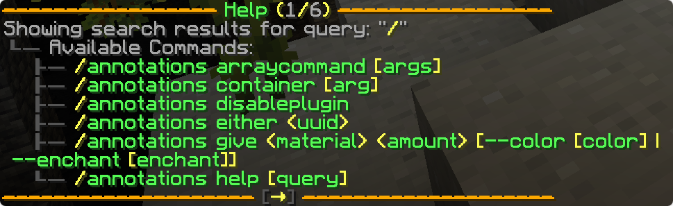
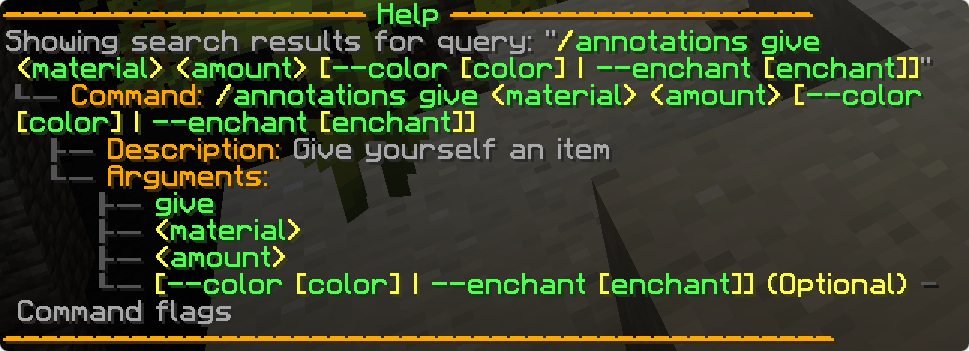

# cloud-minecraft-extras

`cloud-minecraft-extras` contains some optional utilities for the Minecraft integrations.

<!-- prettier-ignore -->
!!! note
    These utilities depend on [adventure](https://docs.advntr.dev/). You may need to depend on Adventure and shade it
    into your project, depending on the platform you're targeting. Many Minecraft platforms, such as Paper, ship with
    native implementations of Adventure, in which case you do not need to include it yourself.

<div class="grid cards" markdown>

- [MinecraftHelp](#minecraft-help)
- [MinecraftExceptionHandler](#minecraft-exception-handler)
- [RichDescription](#rich-description)
- [TextColorParser](#text-color-parser)

</div>

## Installation

Cloud Minecraft Extras is available through [Maven Central](https://central.sonatype.com/artifact/org.incendo/cloud-minecraft-extras).

<!-- prettier-ignore -->
=== "Maven"

    ```xml
    <dependencies>
        <dependency>
            <groupId>org.incendo</groupId>
            <artifactId>cloud-minecraft-extras</artifactId>
            <version>2.0.0-beta.1</version>
        </dependency>
    </dependencies>
    ```

=== "Gradle (Kotlin)"

    ```kotlin
    implementation("org.incendo:cloud-minecraft-extras:2.0.0-beta.1")
    ```

=== "Gradle (Groovy)"

    ```groovy
    implementation 'org.incendo:cloud-minecraft-extras:2.0.0-beta.1'
    ```

## Minecraft Help

`MinecraftHelp` is an opinionated implementation of the [help system](../core/index.md#help-generation) using
Adventure components for styling and click handling.

<!--


-->

<figure markdown>
  
  <figcaption>Index View</figcaption>
</figure>

<figure markdown>
  
  <figcaption>Verbose View</figcaption>
</figure>

All interactions with the Minecraft help system will take place through a `MinecraftHelp` instance.

You may create an instance with the default styling:

<!-- prettier-ignore -->
=== "Native Audience"

    ```java
    // Assuming YourSenderType extends Audience
    MinecraftHelp<YourSenderType> help = MinecraftHelp.createNative(
      "helpcommand",
      commandManager
    );
    ```

=== "Other"

    ```java
    MinecraftHelp<YourSenderType> help = MinecraftHelp.create(
      "helpcommand",
      commandManager,
      audienceMapper // YourSenderType -> Audience
    );
    ```

or you may override the defaults by using a builder:

<!-- prettier-ignore -->
=== "Native Audience"

    ```java
    MinecraftHelp<YourSenderType> help = MinecraftHelp.<YourSenderType>builder()
      .commandManager(commandManager)
      .audienceProvider(AudienceProvider.nativeProvider())
      .commandPrefix("/helpcommand")
      .colors(MinecraftHelp.helpColors(/* colors... */))
      /* other settings... */
      .build();
    ```

=== "Other"

    ```java
    MinecraftHelp<YourSenderType> help = MinecraftHelp.<YourSenderType>builder()
      .commandManager(commandManager)
      .audienceProvider(yourAudienceProvider)
      .commandPrefix("/helpcommand")
      .colors(MinecraftHelp.helpColors(/* colors... */))
      /* other settings... */
      .build();
    ```

You then want to invoke `MinecraftHelp.queryCommands(query, recipient)` in order to query the commands
and display the results to the recipient.

```java title="Example Help Command"
commandManager.command(
  commandManager.commandBuilder("helpcommand")
    .optional("query", greedyStringParser(), DefaultValue.constant(""))
    .handler(context -> {
      help.queryCommands(context.get("query"), context.sender());
    })
);
```

You may choose to add suggestions to the query argument as well:

```java title="Query Suggestions"
.optional(
  "query",
  greedyStringParser(),
  DefaultValue.constant(""),
  SuggestionProvider.blocking((ctx, in) -> commandManager.createHelpHandler()
      .queryRootIndex(ctx.sender())
      .entries()
      .stream()
      .map(CommandEntry::syntax)
      .map(Suggestion::simple)
      .collect(Collectors.toList())
  )
)
```

## Minecraft Exception Handler

`MinecraftExceptionHandler` is an opinionated collection of [exception handlers](../core/index.md#exception-handling)
that uses Adventure components for styling.

All interactions with the system are done through an instance of `MinecraftExceptionHandler`.

<!-- prettier-ignore -->
=== "Native Audience"

    ```java
    // Assuming your sender type extends Audience
    MinecraftExceptionHandler.createNative();
    ```

=== "Other"

    ```java
    MinecraftExceptionHandler.create(audienceProvider // C -> Audience);
    ```

You then use the fluent methods to create handlers for the different exception types.
If you want to register the default handlers for all types you may use `defaultHandlers()`.

You may supply a decorator which will transform the created components. This is useful if you
want to prefix all messages, or apply specific styling.

```java title="Example decorator"
MinecraftExceptionHandler.creativeNative()
    .decorator(component -> text()
        .append("[Example] ", NamedTextColor.DARK_RED)
        .append(component)
        .build()
    );
```

When you're done configuring the builder you need to apply it to the command manager by using
`registerTo(CommandManager)`.

```java title="Complete example"
MinecraftExceptionHandler.createNative()
        .defaultHandlers()
        .decorator(component -> text()
            .append("[Example] ", NamedTextColor.DARK_RED)
            .append(component)
            .build()
        )
        .registerTo(manager);
```

## Rich Description

`RichDescription` allows for the use of Adventure components in both component and command descriptions.
These descriptions are supported by [MinecraftHelp](#minecraft-help). If descriptions are used in other places
they are likely to be transformed into plain text.

```java
// Static factory:
Description description = RichDescription.of(text("Hello world!"));

// Statically importable alias:
Description description = RichDescription.richDescription(text("Hello world!"));

// Utility for translatable components:
Description description = RichDescription.translatable("some.key", text("an arg"));
```

## Text Color Parser

`TextColorParser` is a [parser](../core/index.md#parsers) which parses Adventure `TextColor`s.
It parses `NamedTextColor`, legacy color codes using `&` as well as hex codes.

```java
ParserDescriptor<?, TextColor> parser = TextColorParser.textColorParser();
```
