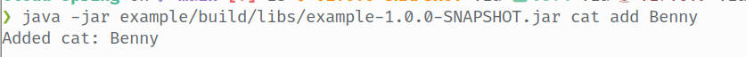
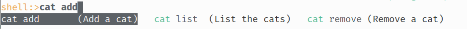
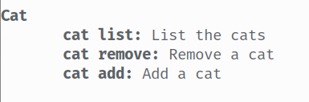
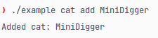

# cloud-spring

This is an opinionated implementation of [Cloud](https://github.com/incendo/cloud) for
[Spring Shell](https://spring.io/projects/spring-shell).
Cloud for Spring maps to a quite small subset of the Spring Shell features and does not aim to be a replacement
for working with spring-shell.
Rather, it's a way to use a familiar command framework to quickly & easily create commands for your Spring application.

Spring Shell uses "options" (what Cloud would call flags) for input, which Cloud does not do.
We therefore map all arguments to an array of strings, which means that we get access to (nearly) all Cloud features.

The example module contains a Spring Boot application with a couple of commands.

## features

- auto-discovery of `CommandBean` instances as well as `@ScanCommands`-annotated classes
- supports both interactive & non-interactive (CLI) commands



- support for Spring Shell features such as descriptions and command groups




- configurable by overriding the bean bindings
- completions!


- support for native builds



## limitations

- no intermediate executors (you can do `/cat add` and `/cat remove` but not `/cat`)

## usage

{{ dependency_listing("spring") }}

You should first familiarize yourself with the [cloud-core](../core/index.md) docs.
The easiest way to use the `SpringCommandManager` is by using `SpringCommandSender` as the command sender type,
because there are default bindings set up for this.
If you want to use a custom command sender type then you'll want to create a binding for `CommandSenderSupplier`:

```java
@Bean
@NonNull CommandSenderSupplier<YourSenderType> commandSenderMapper() {
    return () -> yourSender;
}
```

Cloud will create an instance of `SpringCommandManager` which automatically register commands to Spring Shell.

The recommended way of creating commands is by extending `CommandBean`.
Command beans are automatically registered to the command manager.
Examples can be found
[here](https://github.com/Incendo/cloud-spring/tree/main/example/src/main/java/org/incendo/cloud/spring/example/commands).

You may also autowire the `SpringCommandManager` and manually register commands.

### command execution coordinator

The command execution coordinator can be customized by creating a binding for `SpringCommandExecutionCoordinatorResolver`.
By default, `CommandExecutionCoordinator.simpleCoordinator` will be used.

### annotated commands

If you want to use annotated commands, then you must create a binding for `AnnotationParser`.
When doing so, you also have the option of creating a builder modifier that targets the `@CommandGroup` annotation:

```java
@Bean
@NonNull AnnotationParser<YourSenderType> annotationParser(
        final @NonNull SpringCommandManager<YourSenderType> commandManager
) {
    final AnnotationParser<YourSenderType> annotationParser = new AnnotationParser<>(
            commandManager,
            YourSenderType.class
    );
    // Optional: Binding for `@CommandGroup`
    annotationParser.registerBuilderModifier(CommandGroup.class,
            (annotation, builder) -> builder.meta(SpringCommandManager.COMMAND_GROUP_KEY, annotation.value()));
    return annotationParser;
}
```

Cloud will then automatically detect all beans annotated with `@ScanCommands` and register them to `AnnotationParser`:

```java
@ScanCommands
@Component
public class SomeCommand {

    @CommandGroup("A group")
    @CommandDescription("A description")
    @CommandMethod("A command")
    public void yourCommand() {
        // ...
    }
}
```

Spring beans can be injected into command methods. You may annotated the injected members with `@Qualifier`:

```java
@CommandMethod("command <argument>")
public void yourCommand(
        @Argument String argument,
        @Qualifier("bean") SomeBean someBean
) {
    // ...
}
```

### completions

Cloud suggestions will be invoked to provide suggestions for your commands.
You can use normal suggestions, but we also offer `CloudCompletionProposal` which
allows you to use rich completions:

```java
CloudCompletionProposal.of("proposal")
    .displayName("with a display name")
    .category("and a category");
```
